# Polling App — AWS ECS (Fargate) on Terraform

A production-style deployment of the Polling App (React + Spring Boot + MySQL) on **AWS ECS Fargate**, fully provisioned through **modular Terraform**, with a **Jenkins** pipeline handling both infrastructure changes and application releases.

This is the AWS/ECS counterpart to the [Kubernetes deployment](https://github.com/Vinod7raj/Polling-app-devops) of the same application — built to show the same app running correctly across two different orchestration models, both driven entirely by IaC.

🔗 **Live demo**: [polling-app.xyz](https://polling-app.xyz)

---

## Architecture

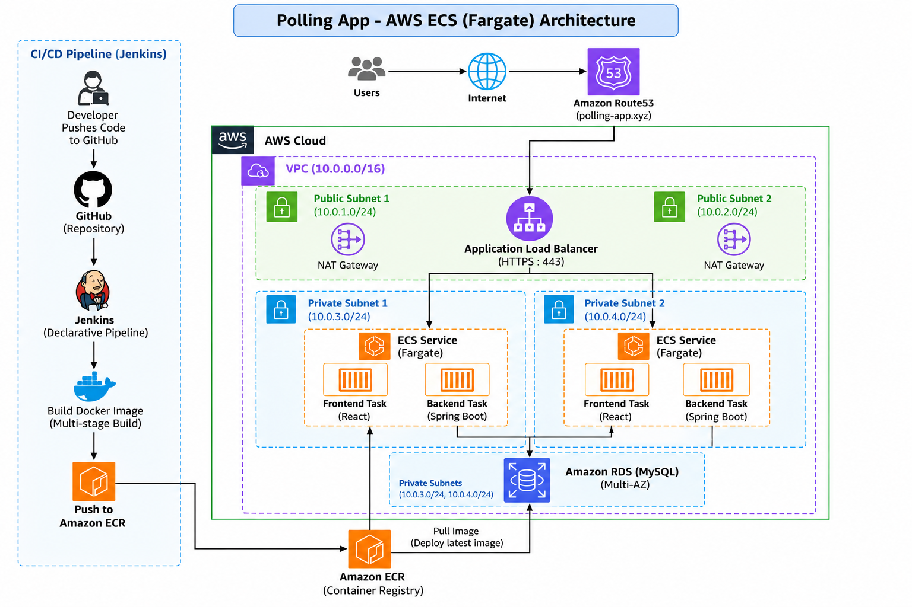

**Request path**: `Users → Route53 (DNS) → ACM (TLS) → ALB → ECS Fargate (frontend or backend, by path) → RDS`
**Delivery path**: `Jenkins → build & push image to ECR → ECS service update → rolling deployment`

Key design points:
- **Two-tier private networking** — ALB is the only public-facing component; ECS tasks and RDS sit in private subnets with no public IP, reachable only through the ALB
- **Security groups chained by reference, not CIDR** — ALB SG (public) → ECS SG (ALB only) → RDS SG (ECS only), so nothing has to hardcode IP ranges and the rule stays correct as tasks scale up/down
- **Path-based routing on one ALB** — `/api/*` forwards to the backend target group, everything else to the frontend, so both tiers share a single domain and certificate
- **awsvpc networking mode** — every ECS task gets its own ENI and private IP (required for Fargate), which is also what lets each task carry its own security group posture rather than sharing the host's

---

## Screenshots

> Filenames below are shown to match the project's `Screenshots/` folder — if any actual filename differs, adjust the path, the image itself will still display correctly once it matches.

**Application**
| | |
|---|---|
| 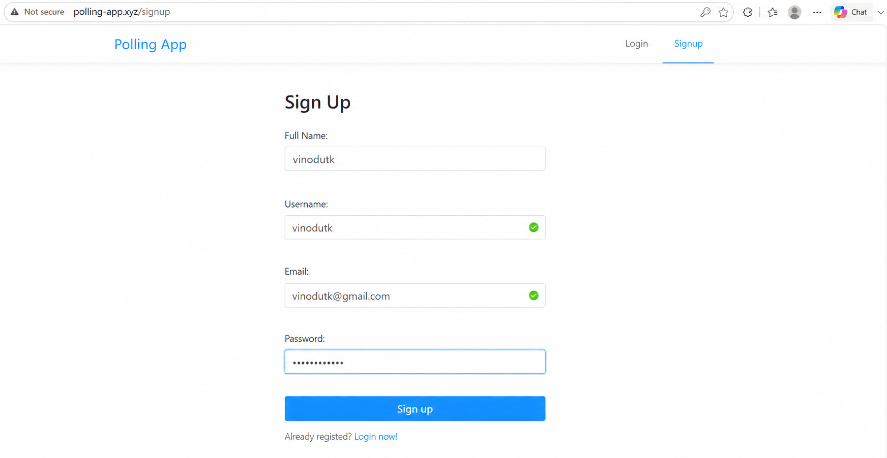 Signup page | 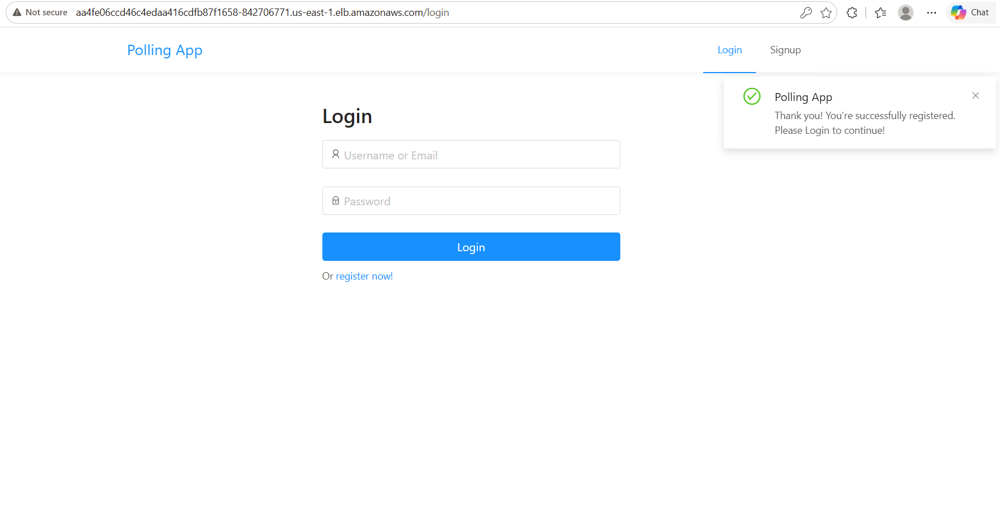 Registered → login prompt |
| 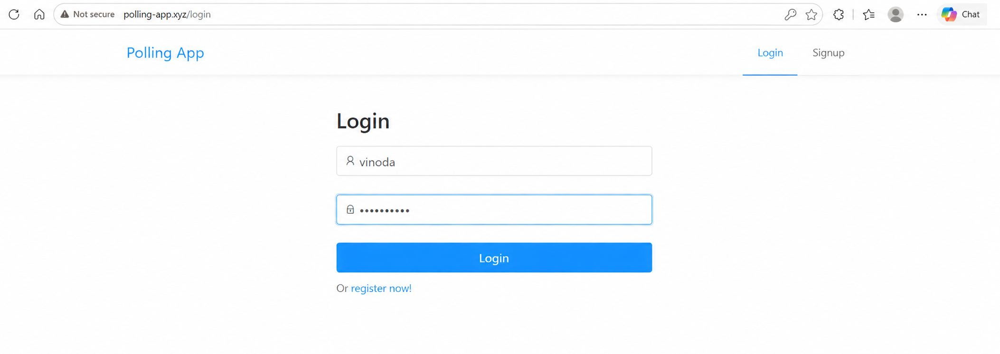 Login form | 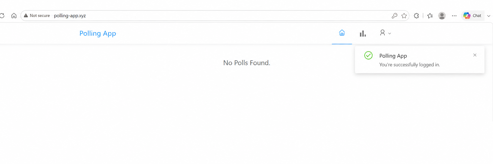 Logged-in home, served over HTTPS on the custom domain |

**Infrastructure**
| | |
|---|---|
| 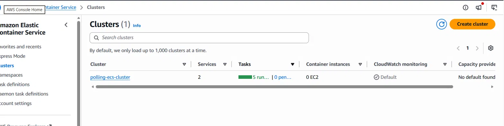 ECS cluster — both services running | 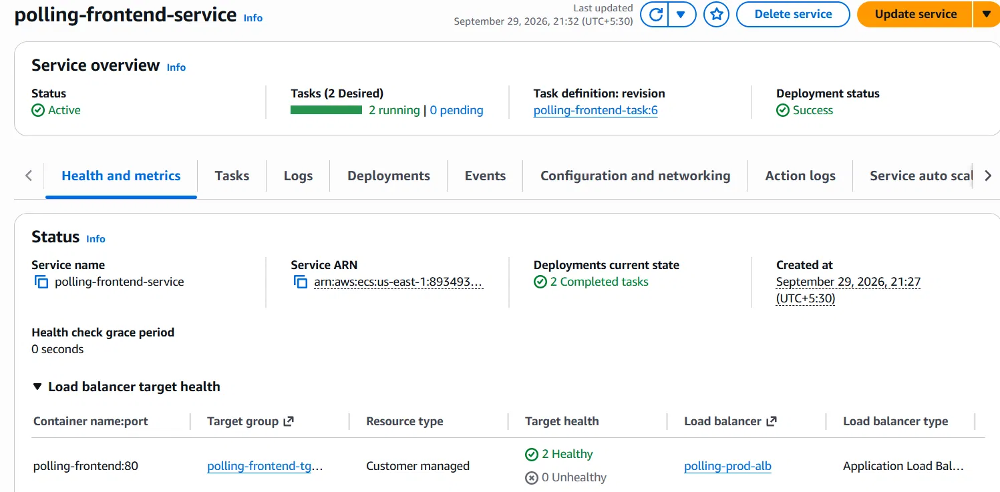 Frontend service, healthy targets |
|  Backend service, healthy targets | 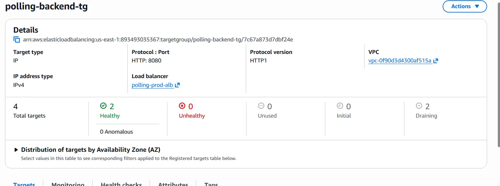 Backend ALB target group detail |
| 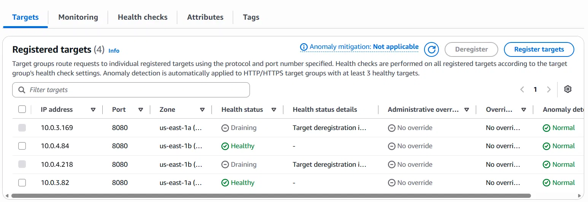 Registered targets, healthy | 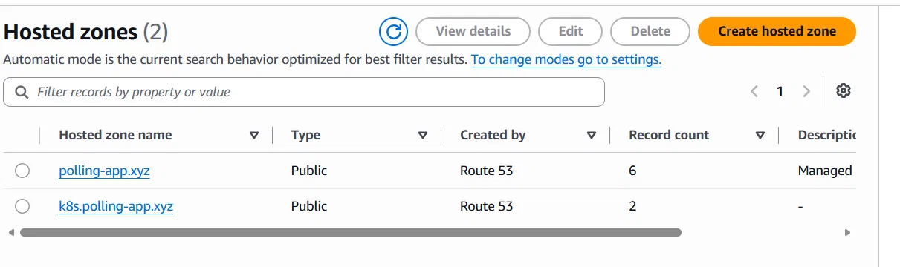 Route53 hosted zones |
| 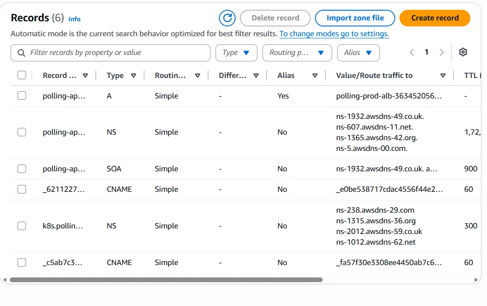 DNS records — A/Alias to ALB, NS, ACM validation CNAMEs | 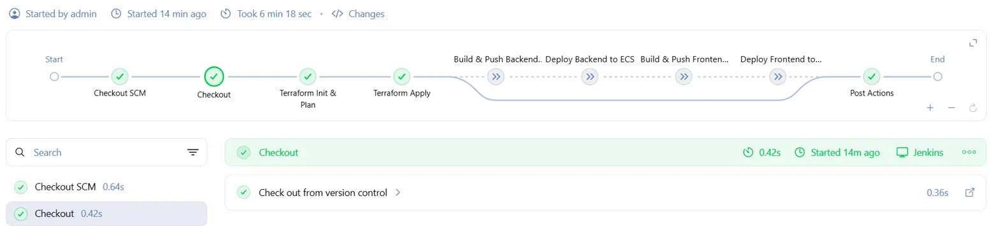 Jenkins pipeline, full run succeeded |

---

## Terraform layout

```
terraform/
├── backend.tf          # S3 remote state
├── main.tf              # module wiring
├── variables.tf
├── outputs.tf
├── versions.tf
├── terraform.tfvars.example
└── modules/
    ├── vpc/              # VPC, public/private subnets, IGW, NAT Gateway, route tables
    ├── security-groups/  # ALB SG, ECS SG, RDS SG (chained by SG reference)
    ├── alb/               # ALB, target groups, HTTP/HTTPS listeners, path-based listener rule
    ├── ecs/               # ECS cluster, task definitions, services, IAM execution role
    ├── rds/               # RDS instance + subnet group
    ├── acm-route53/     # Hosted zone, ACM cert, DNS validation records
    └── cloudwatch/      # CPU alarm, SNS topic + email subscription
```

Each module exposes its own `variables.tf`/`outputs.tf`; `main.tf` at the root wires them together (e.g., the `vpc` module's private subnet IDs feed into both `ecs` and `rds`).

### State

Remote backend: **S3**, with state at `polling-app/terraform.tfstate`. This isn't just a preference — the Route53 hosted zone was created manually and later `terraform import`-ed (see [Troubleshooting](#troubleshooting)), and a local-only state would have meant Jenkins had no record of that import, risking a duplicate zone with mismatched NS records on the very first automated apply. Remote state means every apply — local or Jenkins — reads the same source of truth.

### Key resources per module

| Module | Notable resources |
|---|---|
| `vpc` | `aws_vpc`, 2× `aws_subnet` (public), 2× `aws_subnet` (private), `aws_internet_gateway`, `aws_nat_gateway`, `aws_eip`, public/private `aws_route_table` + associations |
| `security-groups` | `aws_security_group` × 3, each referencing the previous tier's SG ID as its ingress source rather than a CIDR block |
| `alb` | `aws_lb`, `aws_lb_target_group` × 2 (`target_type = "ip"` — required for Fargate/awsvpc), `aws_lb_listener` (80→443 redirect, 443 TLS termination), `aws_lb_listener_rule` (path-based `/api/*`) |
| `ecs` | `aws_ecs_cluster`, `aws_ecs_task_definition` × 2 (`FARGATE`, `awsvpc`), `aws_ecs_service` × 2, `aws_iam_role` (task execution role) + `AmazonECSTaskExecutionRolePolicy` attachment |
| `rds` | `aws_db_subnet_group`, `aws_db_instance` (MySQL 8.0, single-AZ) |
| `acm-route53` | `aws_route53_zone` (imported, not created fresh — see below), `aws_acm_certificate` (DNS validation), `aws_route53_record` (validation CNAMEs), `aws_acm_certificate_validation` |
| `cloudwatch` | `aws_cloudwatch_metric_alarm` (ECS CPU), `aws_sns_topic`, `aws_sns_topic_subscription` (email) |

### Variables (`terraform.tfvars.example`)

Real values are never committed — copy this file to `terraform.tfvars` and fill in your own:

```hcl
domain_name           = "yourdomain.com"
db_username            = "admin"
db_password            = "changeme"
alert_email            = "you@example.com"
vpc_cidr_block         = "10.0.0.0/16"
public_subnet_cidrs    = ["10.0.1.0/24", "10.0.2.0/24"]
private_subnet_cidrs   = ["10.0.11.0/24", "10.0.12.0/24"]
```

---

## Prerequisites

- AWS account, with the app's domain already registered (Route53-manageable)
- Terraform ≥ 1.5
- Jenkins with Docker, Terraform, and AWS CLI installed on the agent
- An IAM role attached to the Jenkins EC2 instance (ECR, ECS, and the resource types each module manages) — **no static AWS access keys are used anywhere in this project**

---

## Deploying

**First-time bootstrap** (subsequent changes go through the pipeline, not this):
```bash
cd terraform
cp terraform.tfvars.example terraform.tfvars   # fill in real values
terraform init
terraform plan
terraform apply
```

---

## CI/CD pipeline

Single Jenkinsfile, two independent paths — each runs only when its relevant files change:

| Path | Trigger | Steps |
|---|---|---|
| **Infra** | `terraform/**` changed, `main` branch only | `terraform plan` → **manual approval gate** → `terraform apply` |
| **App** | `polling-app-client/**` or `polling-app-server/**` changed | Docker build → push to ECR → `ecs update-service --force-new-deployment` → wait for stable |

**Why split like this**: infra changes are rare and high blast-radius (a bad `apply` can take down a database); app changes are frequent and cheap to roll forward from. The pipeline is deliberately more cautious with one than the other — manual approval on infra, none needed on app deploys.

**Secrets handling** — nothing sensitive is stored as plaintext, anywhere:
- AWS auth → IAM instance role on the Jenkins EC2 box, not access keys
- Terraform variables → bundled as one Jenkins **Secret file** credential, injected as `$TF_VAR_FILE` and passed via `-var-file` — one credential covers every variable instead of one-per-secret
- GitHub checkout → PAT stored as a Jenkins "Username with password" credential, scoped read-only to this repo
- `.gitignore` excludes `*.tfvars`, `*.tfstate`, and `.terraform/` — only `terraform.tfvars.example` (placeholders) is ever committed

**Why task definition changes and code changes roll out differently**: ECS task definitions are immutable — any change inside them (env vars, image reference, cpu/memory) forces Terraform to register a brand-new revision, and updating the service's revision triggers ECS's own rolling deployment automatically. A new image pushed under the *same* tag (`:latest`) doesn't change anything Terraform can see, which is exactly why the app pipeline needs `--force-new-deployment` — from ECS's point of view, on paper, nothing changed.

---

## Troubleshooting

**Route53 zone manually created and imported — and why that forced a remote backend**

The hosted zone had to be created manually, outside Terraform, so its NS records could be registered at the domain registrar *before* anything else touched DNS — creating it fresh through Terraform later would have produced a different set of NS records than the ones already live at the registrar, breaking resolution entirely.

`terraform import` brought the existing zone under management without recreating it — but state was still local at that point, meaning the import only existed on one machine. Left as-is, a Jenkins run against fresh, empty state would have seen no record of the zone at all and tried to create it again, generating new NS records that no longer matched the registrar — silently breaking the domain the moment CI ran.

**Fix**: migrated state to an S3 backend (`terraform init -migrate-state`) immediately after the import, with the full config (cert validation included) restored first, so what got pushed to S3 matched the real, final intended state. Verified with `terraform plan` showing zero changes for the zone before ever letting Jenkins near it. `prevent_destroy` was added to the zone resource afterward as a guardrail.

**Other issues worth knowing the shape of:**
- **502/503 from ALB** → target group health → ECS service events → CloudWatch Logs → security group path
- **ACM stuck "Pending validation"** → confirm the validation CNAME landed in the correct hosted zone, exactly as ACM specified it
- **ECS task stuck PENDING / cycling** → `aws ecs describe-tasks`, read `stoppedReason` — usually an image pull failure (execution role, or a missing NAT route from the private subnet) or a health check killing the task before startup finishes
- **Env var change not showing up after a deploy** → env vars only change when the *task definition* changes (a new revision via Terraform); the app pipeline's `force-new-deployment` restarts tasks on the *same* revision, so it will never pick up an env var change on its own

---

## Architecture decisions & trade-offs

Deliberately cost-conscious rather than fully production-hardened — each of these is a known, intentional call, not an oversight:

- **Single-AZ RDS** — Multi-AZ (synchronous standby, automatic failover) would be the production choice, at roughly double the DB cost
- **Fixed ECS desired count** — no autoscaling policy yet; the CloudWatch CPU alarm currently only notifies via SNS, it doesn't scale anything
- **Rolling deployments via ECS's built-in behavior** — no blue/green yet; CodeDeploy integration would be the next step for safer, gradual-traffic releases
- **DB credentials as task definition env vars** — functional, but Secrets Manager + the task definition's `secrets` block (`valueFrom`) is the correct next step, since env vars are visible in plaintext via the ECS console/API

---

## Related

- [Kubernetes deployment of the same app](https://github.com/Vinod7raj/Polling-app-devops) — same application on Kops + Jenkins + Prometheus/Grafana, for a side-by-side comparison of both orchestration approaches
